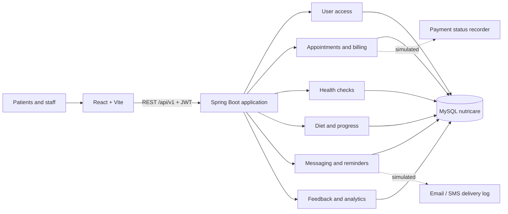

# Architecture and Module Boundaries

## Context

## Composition

The root Maven project builds six feature jars and the top-level `backend` executable. Component scanning discovers every controller, service, repository and entity under `lk.sliit.nutricare`. The Vite application imports one React feature package from each student folder and supplies the common shell, navigation and design tokens.

Cross-module records use UUID values rather than Java entity relationships. This keeps compile-time ownership clear while allowing database indexes and API contracts to join data. Feature modules do not import another member's persistence classes; integration occurs through IDs, stable REST operations, and the shared SQL contract. Authentication is supplied by Module 01 through Spring Security. Changes that affect another module require an OpenAPI change and team review.

## Data flow

1. Login issues an eight-hour HMAC-signed JWT containing user ID, email and role.
2. The browser sends the token as `Authorization: Bearer …`.
3. Controllers validate input; services enforce state transitions inside transactions.
4. JPA repositories persist records to the shared database created by Flyway migrations.
5. API responses exclude password hashes and prohibited payment credentials.

## Standard API behavior

- Prefix: `/api/v1`
- Content type: `application/json`
- IDs: UUID strings
- Validation: HTTP 400 with `code=VALIDATION_ERROR` and `fields`
- State conflict: HTTP 409 with `code=CONFLICT`
- Missing authentication: HTTP 401; insufficient permission: HTTP 403
- Timestamps: ISO-8601
