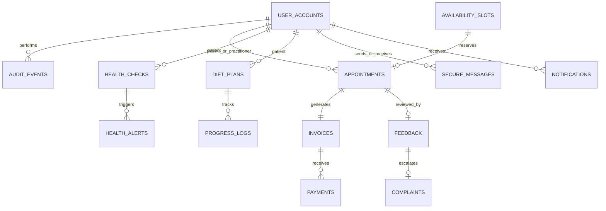

# Database Design and Data Dictionary

## Entity relationship overview

## Table ownership

| Migration | Tables | Owner |
| --- | --- | --- |
| V1 | `user_accounts`, `audit_events` | Module 01 |
| V2 | `availability_slots`, `appointments`, `invoices`, `payments` | Module 02 |
| V3 | `health_checks`, `health_alerts` | Module 03 |
| V4 | `diet_plans`, `progress_logs` | Module 04 |
| V5 | `secure_messages`, `notifications` | Module 05 |
| V6 | `feedback`, `complaints` | Module 06 |
| V7 | Safe synthetic demo users and slots | Integration |
| V8 | Account lifecycle fields, protected foreign keys and remaining demo roles | Integration |
| V9 | Complete fictional records for every table and end-to-end demo relationships | Integration |
| V10 | Mandatory staff password changes, hashed reset OTPs and email delivery audit records | Modules 01 and 03 / Integration |
| V11 | Verified local seed-account password hashes | Integration |
| V12 | Converts every UUID primary and foreign key to readable `VARCHAR(36)` without changing its value | Integration |
| V13 | Replaces user UUIDs with simple role-prefixed account keys and updates every relationship | Integration |

The `user_accounts.id` primary key uses a short role prefix followed by three digits. Examples are `P001` for a patient, `D001` for a doctor, `DT001` for a dietitian and `A001` for an administrator. The `account_id_counters` table is locked transactionally while a new ID is allocated, preventing duplicate IDs during simultaneous registrations. Account IDs never change after creation, even if an administrator changes the role, because other tables reference the stable identity. Transactional tables such as appointments, health checks and invoices retain UUID primary keys as readable `VARCHAR(36)` values. Monetary values use `DECIMAL(12,2)`. Clinical measurements use fixed-point decimals.

Role prefixes are: `P` patient, `D` doctor, `DT` dietitian, `R` reception, `A` administrator, `O` operations manager, `F` finance, `C` medical-center coordinator and `PR` patient-relations officer.

All cross-module relationships now use explicit foreign keys with `ON DELETE RESTRICT`. The application exposes no user deletion endpoint. Administrators change `enabled` status instead, preserving appointments, medical history, messages, invoices, feedback and audit evidence.

## Migration policy

- Never edit a migration already shared with another member; add the next version.
- Migrations must be backward-safe for existing demo data.
- Schema names use lower-case snake case; Java fields use camel case.
- Sample records must be fictional and visibly demo-only.
- Before merging, start a fresh MySQL container and run all migrations from V1.
